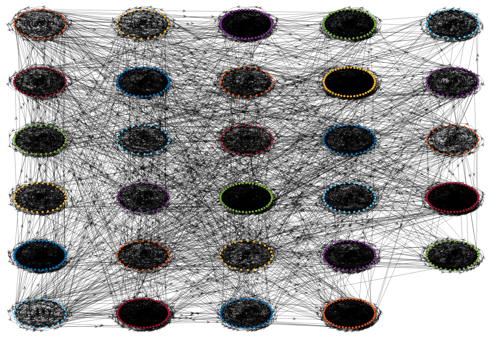
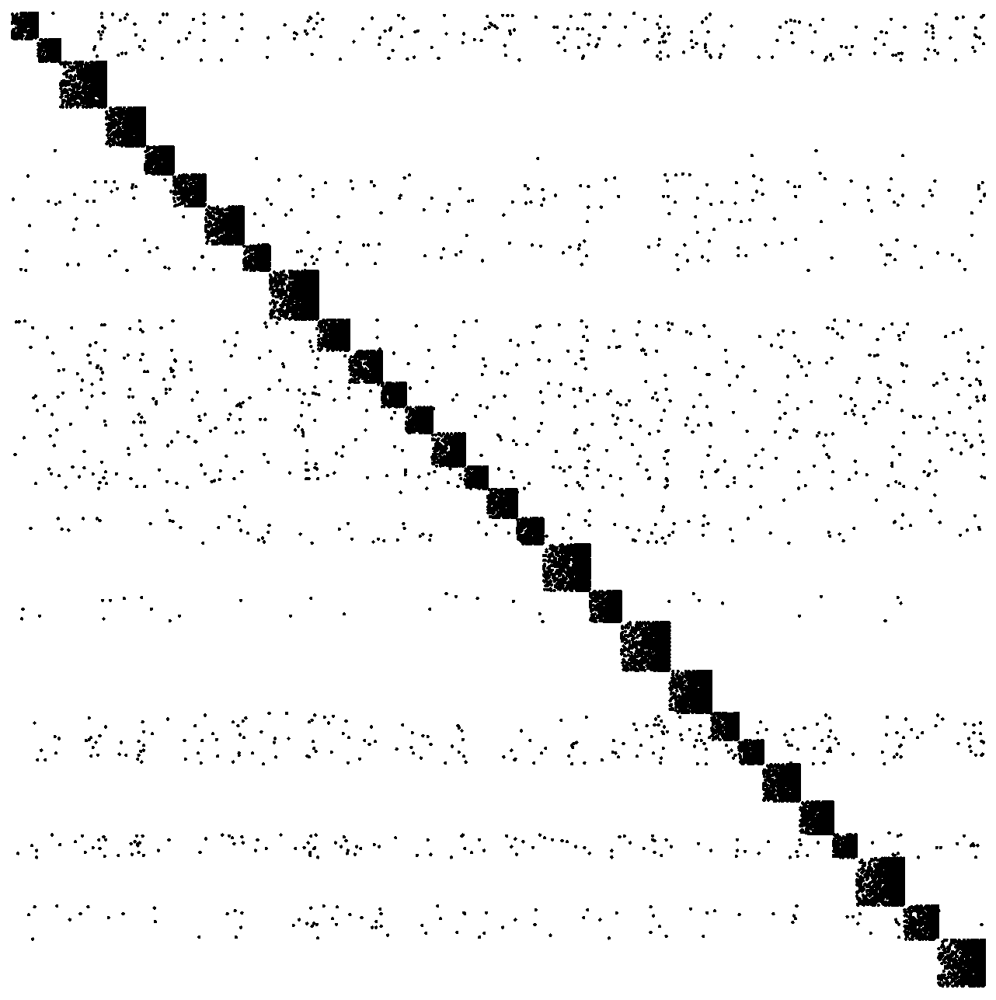

# Spectral Embeddings for Directed Graph Clustering (MATLAB)

> Code accompanying the master’s thesis  
> **“Spectral embeddings for directed graph clustering” — Jacopo Palumbo (2025)**


<p align="center">
  
  
</p>

This repository implements five adjacency-based **spectral clustering** pipelines for **directed graphs** and their **2D dimensionality-reduced** variants (via KL-divergence minimization / t-SNE) applied **before** \(k\)-means:

- **ASE** — Adjacency Spectral Embedding (scaled / unscaled)  
- **HERM** — Hermitian spectral clustering  
- **SKEW** — Skew-symmetric spectral clustering  
- **BCS** — Block-Cyclic Spectral clustering  
- **BAS** — Block-Acyclic Spectral clustering  

Experiments cover synthetic **DSBM** and **LFR** graphs, plus real data (**EmailEU**, **AMLSim**). Metrics include **F-Score**, **NMI**, **ARI** (label-based) and **Cut-Imbalance / Trade-Flow** (flow-based).


## Repository layout
The structure of the repository is the following:

```bash
├── addpaths_SC.m       # Add project paths in MATLAB (run this first)
├── experiments         # Scripts for end-to-end experiments
│   ├── results         # Where the results are saved
│   └── visualization   # Scripts used for plotting and figure export
├── methods             # Implementations of ASE, HERM, SKEW, BCS, BAS (+ t-SNE variants)
├── metrics             # Implementations of F-Score, NMI, ARI, CI/Top-CI, TF/Top-TF, etc.
├── real_world          # Real-world datasets (EmailEU, AMLSim) + loaders
└── synthetic           # Synthetic generators (DSBM, LFR)
````

More documentation regarding each script is provided as comments inside the code.


## Requirements

* **MATLAB** R2024b or newer (tested on R2024b)
* **Statistics and Machine Learning Toolbox** (for `kmeans`, `tsne`)


## Quick start

1. **Open MATLAB** in the repository root and add paths:

   ```matlab
   addpaths_SC
   ```

2. **Run a demo** from the `experiments` folder.

3. **Inspect results** written under `experiments/results` and **plot results** under `experiments/visualization`.


## Methods (what each script does)

* **ASE — `SVD_scaled.m` / `SVD_unscaled.m` (+ `_tSNE.m`)**
  SVD of $A$. Scaled embedding uses $[U_d \Sigma_d^{1/2} \mid V_d \Sigma_d^{1/2}]$; unscaled uses $[U_d \mid V_d]$.
  Optional 2D t-SNE (KL minimization) before $k$-means.

* **HERM — `HermitianClustering*.m`**
  Build $H = i(A - A^\top)$; select leading eigenvectors / projection features, then $k$-means. `_tSNE` variants apply 2D t-SNE first.

* **SKEW — `SkewSymmetricClustering*.m`**
  Use $K = A - A^\top$, compute truncated SVD, take $U_d$ as embedding, then $k$-means. `_tSNE` variants apply 2D t-SNE first.

* **BCS — `BCS*.m`**
  Form row-stochastic transition $P = D_{\text{out}}^{-1} W$; take cycle eigenvectors (largest modulus), concatenate real/imag parts; $k$-means. `_tSNE` adds 2D map before clustering.

* **BAS — `BAS*.m`**
  Augment sinks with uniform out-links (acyclic → nested block-cycle), then proceed as BCS. `_tSNE` adds 2D map before clustering.


## Metrics

Implemented under `metrics/`:

* **Label-based:** F-Score, NMI, ARI (available when ground-truth labels exist)
* **Flow-based:** Cut-Imbalance (CI) and **Top-CI** (size/volume normalized), Trade-Flow (TF) and **Top-TF**
* **Utilities:** modularity, precedence alignment, score aggregation helpers

## Acknowledgements

This work is carried out under the supervision of Prof. Olaf Schenk (Advisor) and Dr. Dimosthenis Pasadakis (Co-Advisor). Parts of the work were presented at [PASC25](PASC25_poster.pdf).


## Contact

For questions or issues, please open a GitHub issue or contact **Jacopo Palumbo**.
